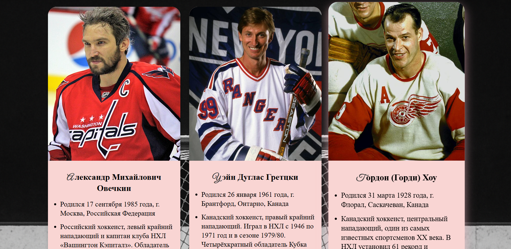

# Список игроков НХЛ, забросивших более 500 шайб

Этот проект представляет собой простую HTML-страницу со списком легендарных хоккеистов НХЛ, которые забросили более **500 шайб**.  
На странице представлены карточки игроков с фотографиями, краткой биографией и контактами.

## Структура проекта

- `index.html` — основная HTML-страница
- `style.css` — стили оформления
- `Alex_Ovechkin.jpg`, `Gretzky.jpg`, `Gordon_Howe.jpg`, `Jaromir_Jagr.jpg`, `Brett_Hull.jpg` — фотографии игроков
- `README.md` — описание проекта
- `screenshot.png` — общий скриншот страницы (пример отображения в браузере)

## Запуск проекта

1. Скачайте проект на свой компьютер
2. Убедитесь, что в папке находятся все изображения (`*.jpg`)
3. Откройте файл **`index.html`** в любом браузере (двойным кликом или через контекстное меню → «Открыть с помощью»)

## Скриншот страницы

